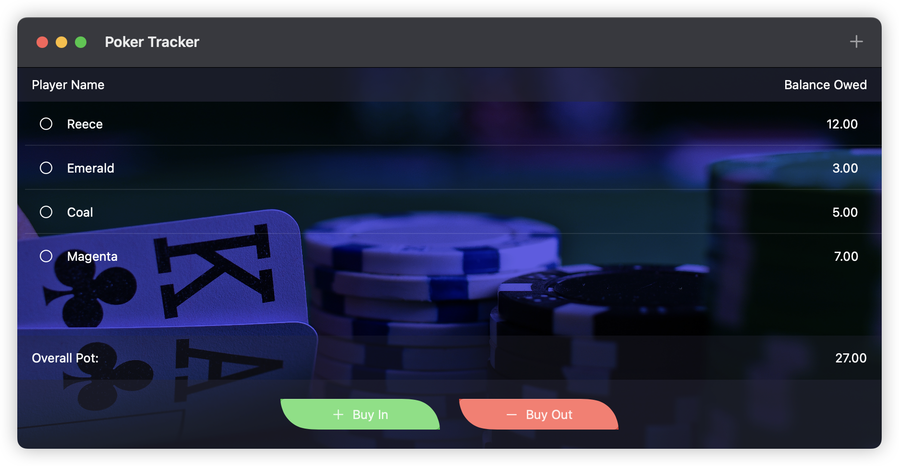
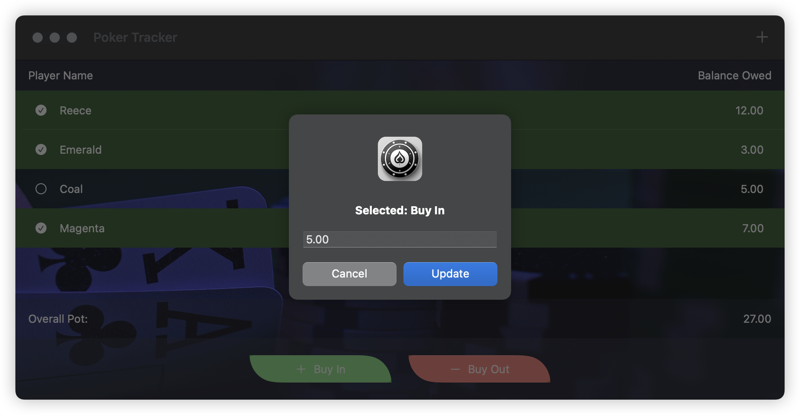
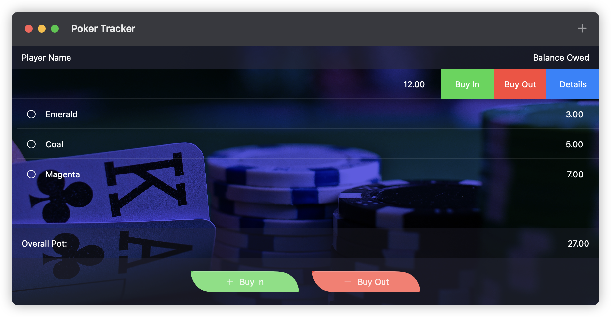
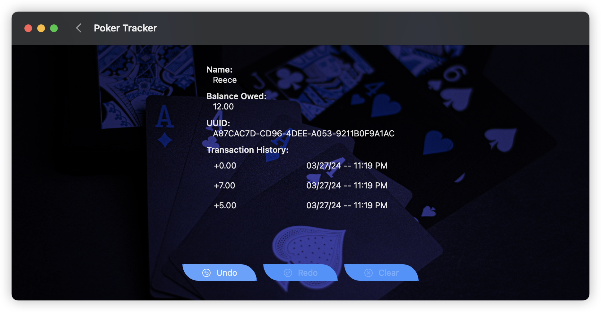

# Poker Tracker

PokerTracker is an app built with **SwiftUI** and **Swift** which aims to help you manage poker game finances among friends. Track player buy-ins, buy-outs, and balances.

## Features

- Add multiple users/players to your pokerTracker
- Record player **buy-ins** and **buy-outs** to track money entering and leaving the game  
- View detailed player information including name and complete transaction history  
- Undo and redo actions to easily correct mistakes  
- Clear all data when needed to start fresh  
- Clean, SwiftUI interface for smooth navigation

## How It Works

1. Log buy-ins and buy-outs after each game or session
2. The app keeps running totals and displays current balances for each player
3. Access transaction history to review all past entries, with options to undo or redo changes
4. Clear data to reset the tracker when starting new games or groups

## Getting Started

### Option 1: Download for MacOS
- Download the PokerTracker-Installer.dmg file
- Move PokerTracker-Installer.app into your applications folder

### Option 2: Run the App Locally or on an iOS Device

- Clone this repository  
- Open `PokerTracker.xcodeproj` in Xcode  
- Build and run the app on an iOS simulator or a physical device running iOS 14+  
- Optionally, export and install the app on your local device via Xcode

## App Visuals

